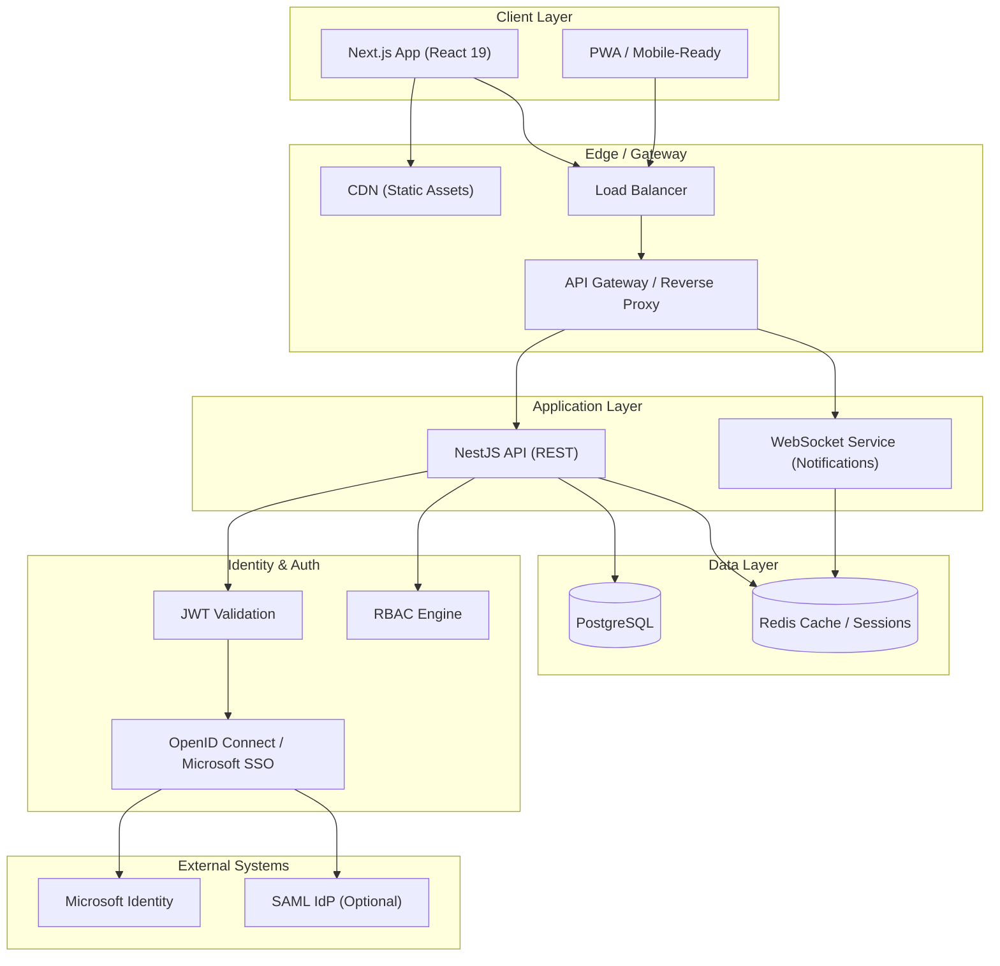
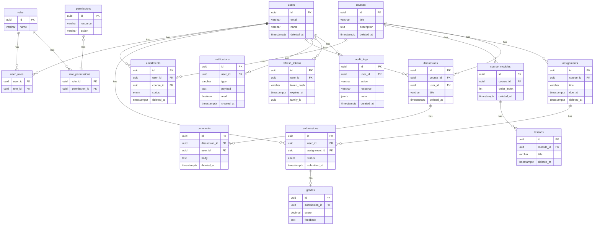
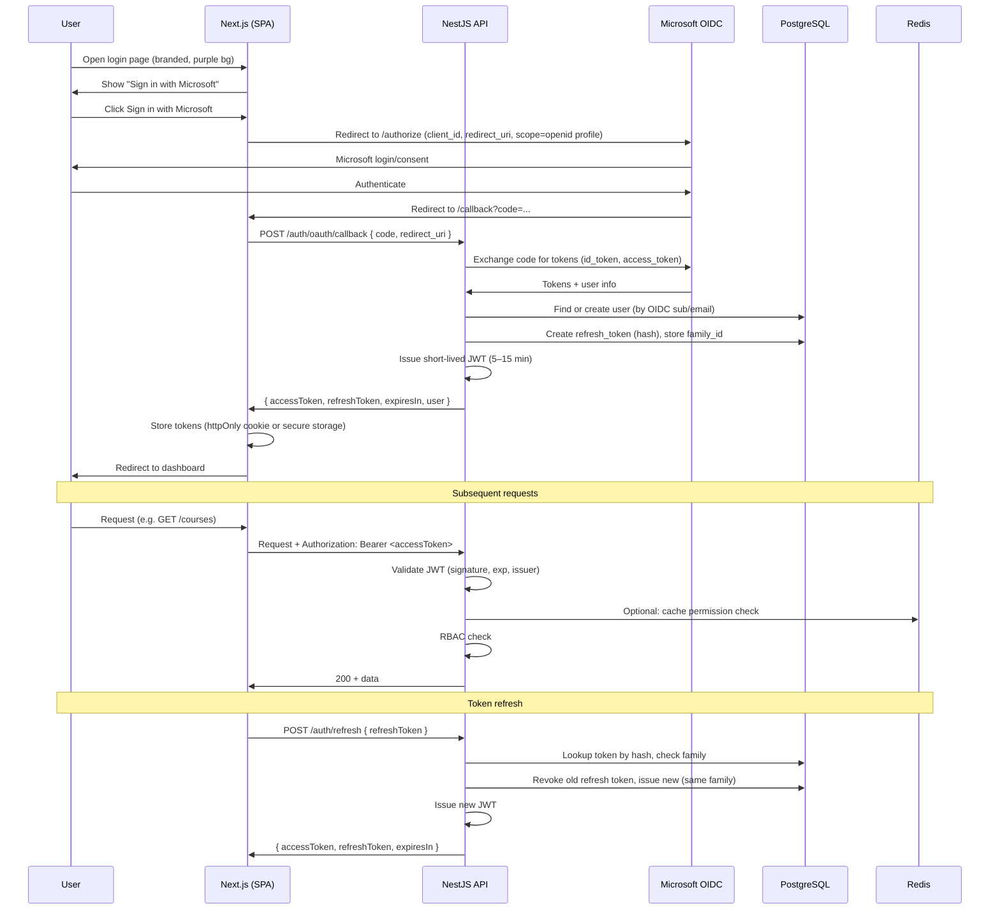
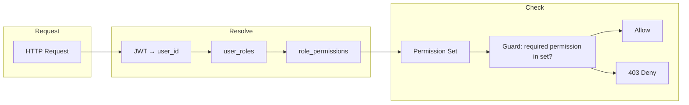

# Enterprise Learning Management System (LMS) — System Design

**Document Version:** 1.0  
**Classification:** Architecture Specification  
**Target:** Production-grade, Halo-level LMS

This document provides the high-level system design, architecture diagrams, folder structures, database schema, authentication flow, RBAC model, API examples, security strategy, scalability considerations, and deployment recommendations. The login experience is designed to align with an enterprise SSO pattern (e.g., “Sign in with Microsoft”) on a branded, purple-tinted background with a central white card—supporting OAuth 2.0 / OpenID Connect.

---

## 1. High-Level System Architecture Diagram



**Layer summary:**

| Layer | Responsibility |
|-------|----------------|
| **Client** | Next.js (React 19), TypeScript, Tailwind, TanStack Query, Zustand/Redux; role-based UI, protected routes, token-based sessions |
| **Edge** | CDN for static assets, load balancer, API gateway (routing, rate limiting, TLS) |
| **Application** | NestJS REST API, optional WebSocket service for real-time notifications |
| **Identity & Auth** | OAuth 2.0 / OpenID Connect (e.g. Microsoft SSO), JWT validation, RBAC |
| **Data** | PostgreSQL (primary store), Redis (cache, rate limit, session/refresh state) |
| **External** | Microsoft Identity (primary SSO), optional SAML IdP |

---

## 2. Detailed Backend Folder Structure

Backend follows **NestJS** with **Clean Architecture / DDD**: Application, Domain, Infrastructure, and Interface (Controllers). Dependency inversion is enforced (domain has no framework dependencies).

```
backend/
├── src/
│   ├── main.ts
│   ├── app.module.ts
│   ├── common/                          # Cross-cutting
│   │   ├── decorators/
│   │   ├── filters/                     # Global exception filters
│   │   ├── guards/                      # Auth, RBAC guards
│   │   ├── interceptors/                # Logging, response formatting
│   │   ├── pipes/                       # Validation pipes
│   │   └── config/                      # Env-based configuration
│   │
│   ├── application/                     # Application Layer (use cases)
│   │   ├── auth/
│   │   │   ├── commands/
│   │   │   ├── queries/
│   │   │   └── handlers/
│   │   ├── user/
│   │   ├── course/
│   │   ├── enrollment/
│   │   ├── assignment/
│   │   ├── gradebook/
│   │   ├── discussion/
│   │   ├── notification/
│   │   └── audit/
│   │
│   ├── domain/                          # Domain Layer (entities, interfaces)
│   │   ├── entities/
│   │   │   ├── user.entity.ts
│   │   │   ├── role.entity.ts
│   │   │   ├── course.entity.ts
│   │   │   ├── enrollment.entity.ts
│   │   │   ├── assignment.entity.ts
│   │   │   ├── submission.entity.ts
│   │   │   ├── grade.entity.ts
│   │   │   ├── discussion.entity.ts
│   │   │   ├── notification.entity.ts
│   │   │   └── audit-log.entity.ts
│   │   └── interfaces/                  # Repository & service contracts
│   │       ├── repositories/
│   │       └── services/
│   │
│   ├── infrastructure/                   # Infrastructure Layer (implementations)
│   │   ├── persistence/
│   │   │   ├── typeorm/                 # Or Prisma, etc.
│   │   │   │   ├── entities/
│   │   │   │   ├── repositories/
│   │   │   │   └── migrations/
│   │   │   └── redis/
│   │   ├── auth/
│   │   │   ├── jwt.strategy.ts
│   │   │   ├── refresh-token.repository.ts
│   │   │   └── oidc/                    # OpenID Connect / Microsoft
│   │   ├── messaging/                   # Optional: event bus, queues
│   │   └── external/                    # Microsoft Graph, etc.
│   │
│   ├── interface/                        # Interface Layer (Controllers)
│   │   ├── http/
│   │   │   ├── controllers/
│   │   │   │   ├── auth.controller.ts
│   │   │   │   ├── users.controller.ts
│   │   │   │   ├── courses.controller.ts
│   │   │   │   ├── enrollments.controller.ts
│   │   │   │   ├── assignments.controller.ts
│   │   │   │   ├── gradebook.controller.ts
│   │   │   │   ├── discussions.controller.ts
│   │   │   │   ├── notifications.controller.ts
│   │   │   │   └── audit.controller.ts
│   │   │   ├── dto/
│   │   │   └── decorators/
│   │   │   └── versioning/              # /v1/, /v2/
│   │   └── websocket/                   # Notifications gateway
│   │
│   └── modules/                          # NestJS feature modules (wire layers)
│       ├── auth/
│       │   ├── auth.module.ts
│       │   └── ...
│       ├── users/
│       ├── courses/
│       ├── enrollments/
│       ├── assignments/
│       ├── gradebook/
│       ├── discussions/
│       ├── notifications/
│       └── audit/
│
├── test/
│   ├── unit/
│   ├── integration/
│   └── e2e/
├── migrations/
├── docker/
├── .env.example
├── nest-cli.json
├── tsconfig.json
└── package.json
```

**Dependency rule:** Domain ← Application ← Infrastructure & Interface. No framework imports in domain.

---

## 3. Frontend Project Structure

Frontend uses **Next.js (React 19)**, **TypeScript**, **TailwindCSS**, **TanStack Query**, **Zustand/Redux Toolkit**, and **ShadCN UI** (or custom design system). Login page follows the reference: central white card, “Log in to your account”, “Sign in with Microsoft” (OAuth/OpenID Connect), on a purple-tinted branded background.

```
frontend/
├── src/
│   ├── app/                              # App Router (Next.js)
│   │   ├── layout.tsx
│   │   ├── page.tsx                     # Landing / redirect
│   │   ├── (auth)/                      # Auth group
│   │   │   ├── login/
│   │   │   │   └── page.tsx             # SSO login (Microsoft) — ref design
│   │   │   ├── callback/                # OAuth callback
│   │   │   └── layout.tsx
│   │   ├── (dashboard)/                 # Protected dashboard
│   │   │   ├── layout.tsx               # Role-based shell
│   │   │   ├── courses/
│   │   │   ├── enrollments/
│   │   │   ├── assignments/
│   │   │   ├── gradebook/
│   │   │   ├── discussions/
│   │   │   └── settings/
│   │   ├── api/                         # API route proxying (if needed)
│   │   │   └── [...proxy]/
│   │   └── not-found.tsx
│   │
│   ├── features/                         # Feature modules
│   │   ├── auth/
│   │   │   ├── components/
│   │   │   ├── hooks/
│   │   │   ├── store/
│   │   │   └── types/
│   │   ├── courses/
│   │   ├── enrollments/
│   │   ├── assignments/
│   │   ├── gradebook/
│   │   ├── discussions/
│   │   └── notifications/
│   │
│   ├── shared/
│   │   ├── components/                  # Shared UI (design system)
│   │   │   ├── ui/                      # ShadCN or custom
│   │   │   ├── layout/
│   │   │   └── feedback/
│   │   ├── hooks/
│   │   ├── lib/
│   │   │   ├── api.ts                   # API client
│   │   │   ├── auth.ts                  # Token handling
│   │   │   └── query-client.ts
│   │   └── types/
│   │
│   ├── services/                        # Data services layer
│   │   ├── api/
│   │   │   ├── auth.service.ts
│   │   │   ├── courses.service.ts
│   │   │   ├── enrollments.service.ts
│   │   │   └── ...
│   │   └── websocket/                   # WebSocket-ready
│   │       └── notifications.client.ts
│   │
│   ├── store/                           # Global state (Zustand/Redux)
│   │   ├── auth.slice.ts
│   │   ├── user.slice.ts
│   │   └── index.ts
│   │
│   ├── guards/                          # Protected routes, role checks
│   │   ├── AuthGuard.tsx
│   │   └── RoleGuard.tsx
│   │
│   └── styles/
│       ├── globals.css
│       └── design-tokens.css            # Purple theme, ref design
│
├── public/
├── next.config.js
├── tailwind.config.js
├── tsconfig.json
└── package.json
```

**Design reference (login):** Centered white card, “Log in to your account”, primary “Sign in with Microsoft” button, optional partner branding at bottom; full-bleed purple-tinted background (WCAG-compliant contrast).

---

## 4. Database Schema Outline

**RDBMS:** PostgreSQL. Normalized schema, indexes on FKs and query hotspots, soft deletes where specified.



**Core tables (concise):**

| Table | Purpose |
|-------|---------|
| `users` | User accounts; soft delete |
| `roles` | Role definitions (Admin, Instructor, Student, etc.) |
| `permissions` | Fine-grained permissions (resource:action) |
| `user_roles`, `role_permissions` | Many-to-many RBAC mapping |
| `courses`, `course_modules`, `lessons` | Course hierarchy; soft delete |
| `enrollments` | User–course link; status; soft delete |
| `assignments`, `submissions`, `grades` | Assignments and grading |
| `discussions`, `comments` | Forums; soft delete |
| `notifications` | In-app notifications |
| `refresh_tokens` | Hashed refresh tokens; family for rotation |
| `audit_logs` | Sensitive action audit trail |

**Practices:** Migrations for all changes; indexes on FKs, `(user_id, course_id)`, `(assignment_id, user_id)`, and time-based queries; analytics-friendly aggregates where needed.

---

## 5. Authentication Flow Diagram

Aligned with “Sign in with Microsoft” and OAuth 2.0 / OpenID Connect.



**Summary:**  
- Login: Redirect to Microsoft → callback → backend exchanges code, creates/updates user, creates hashed refresh token and short-lived JWT → returns tokens to frontend.  
- Requests: Bearer JWT; validated and RBAC-checked.  
- Refresh: Rotate refresh token (same family), issue new JWT; old refresh token revoked.

---

## 6. RBAC Design Model

- **Roles:** e.g. `SuperAdmin`, `Admin`, `Instructor`, `TeachingAssistant`, `Student`, `Guest`.  
- **Permissions:** `resource:action` (e.g. `course:create`, `grade:read`, `user:delete`).  
- **Mapping:** `users` ↔ `roles` (user_roles), `roles` ↔ `permissions` (role_permissions).  
- **Enforcement:**  
  - **Backend:** Guard on each route that resolves user → roles → permissions and checks required permission(s).  
  - **Frontend:** Role-based rendering and route protection (e.g. `RoleGuard`) so only allowed pages/actions are shown.



**Example permission matrix (conceptual):**

| Role | course:read | course:create | grade:read | grade:write | user:manage |
|------|-------------|---------------|------------|------------|-------------|
| SuperAdmin | ✓ | ✓ | ✓ | ✓ | ✓ |
| Instructor | ✓ | ✓ | ✓ | ✓ (own course) | — |
| Student | ✓ (enrolled) | — | ✓ (own) | — | — |

Guards: `@RequirePermissions('course:create')`, `@RequireRoles('Instructor')`; optional resource-level checks (e.g. course id in JWT or DB).

---

## 7. API Structure Examples

**Base URL:** `https://api.<tenant>.lms.example/v1`  
**Auth:** `Authorization: Bearer <accessToken>`  
**Versioning:** Path prefix `/v1/`, future `/v2/`.

| Method | Path | Description | Auth |
|--------|------|-------------|------|
| POST | `/auth/oauth/callback` | Exchange OAuth code for tokens | — |
| POST | `/auth/refresh` | Rotate refresh token, return new JWT | — |
| POST | `/auth/logout` | Revoke refresh token (body: refreshToken) | Optional |
| GET | `/users/me` | Current user profile | JWT |
| GET | `/courses` | List courses (filter by role/enrollment) | JWT |
| GET | `/courses/:id` | Course detail | JWT |
| POST | `/courses` | Create course | JWT + course:create |
| GET | `/courses/:id/enrollments` | Enrollments for course | JWT + course:read |
| POST | `/enrollments` | Enroll user in course | JWT + enrollment:create |
| GET | `/assignments` | List (e.g. by course) | JWT |
| POST | `/assignments/:id/submissions` | Create submission | JWT |
| GET | `/gradebook/courses/:courseId` | Gradebook view | JWT + grade:read |
| PUT | `/submissions/:id/grade` | Set grade | JWT + grade:write |
| GET | `/discussions` | List discussions (e.g. by course) | JWT |
| POST | `/discussions/:id/comments` | Add comment | JWT |
| GET | `/notifications` | User notifications | JWT |
| PATCH | `/notifications/:id/read` | Mark read | JWT |
| GET | `/audit-logs` | Query audit (admin) | JWT + audit:read |

**Sample request/response (DTOs with class-validator):**

```http
GET /v1/courses?page=1&limit=20
Authorization: Bearer <accessToken>
```

```json
{
  "data": [
    {
      "id": "uuid",
      "title": "Introduction to Computer Science",
      "description": "...",
      "status": "published",
      "createdAt": "2025-02-15T00:00:00Z"
    }
  ],
  "meta": { "page": 1, "limit": 20, "total": 42 }
}
```

**Error response (global filter):**

```json
{
  "statusCode": 403,
  "error": "Forbidden",
  "message": "Insufficient permissions",
  "timestamp": "2025-02-15T12:00:00Z"
}
```

---

## 8. Security Strategy Documentation

| Area | Measure |
|------|--------|
| **Access tokens** | Short-lived JWT (5–15 min); signed (RS256/HS256); validated (signature, exp, iss, aud). |
| **Refresh tokens** | Stored hashed in DB; rotation on every use; family id for detection of reuse; revocation on logout or compromise. |
| **OAuth/SSO** | PKCE for public clients; state for CSRF; strict redirect_uri allowlist; store only necessary OIDC claims. |
| **Passwords** | If local auth exists: bcrypt or argon2; no plaintext storage. |
| **RBAC** | Guard-based route protection; permission checks in backend; no trust of frontend-only checks for sensitive ops. |
| **Rate limiting** | Per-IP and per-user (Redis); stricter on /auth and password reset. |
| **CSRF** | SameSite cookies; CSRF token for state-changing operations if cookie-based. |
| **Input** | class-validator DTOs; sanitization of rich text; parameterized queries (no raw SQL concatenation). |
| **Headers** | HSTS, X-Content-Type-Options, CSP, X-Frame-Options. |
| **Audit** | Log auth events, role/permission changes, grade changes, and data access to audit_logs. |
| **Secrets** | Env-based config; no secrets in repo; rotation policy for signing keys and client secrets. |

---

## 9. Scalability Considerations

- **Horizontal scaling:** Stateless API; multiple NestJS instances behind load balancer; session/refresh state in DB (and optionally Redis).  
- **Database:** Connection pooling; read replicas for reporting/analytics; indexing and query optimization; partition audit_logs by time if very large.  
- **Caching:** Redis for permission checks, course catalog, and hot reads; cache invalidation on write.  
- **Async:** Optional message queue (e.g. Bull/Redis) for notifications, emails, and heavy jobs to keep HTTP latency low.  
- **Multi-tenancy:** Tenant id in JWT and DB (e.g. `tenant_id` on users/courses); row-level filtering or schema-per-tenant depending on isolation requirements.  
- **WebSocket:** Scale notification service with sticky sessions or Redis pub/sub for cross-instance broadcast.

---

## 10. Deployment Readiness Recommendations

- **Containers:** Dockerfile for NestJS API and Next.js (standalone output); docker-compose for local dev (API + PG + Redis).  
- **Orchestration:** Kubernetes (or equivalent) for API and frontend; secrets and config from vault or K8s secrets.  
- **CI/CD:** Build, run unit/integration tests, run migrations, deploy to staging then production; gates for security scans and lint.  
- **Observability:** Structured logging (e.g. JSON); correlation id; metrics (request rate, latency, errors); health checks (`/health`, `/ready`).  
- **Migrations:** Run as part of deployment or separate job; backward-compatible schema changes; rollback plan.  
- **Feature flags:** For SSO rollout and major features; stored in config or feature-flag service.

---

## Design Reference: Login Page

The login experience should match the provided reference:

- **Layout:** Full-viewport, purple-tinted background (e.g. campus/sky image with overlay).  
- **Card:** Single centered white card with rounded corners and shadow.  
- **Content:** Institution logo at top; “Log in to your account”; single primary CTA: **“Sign in with Microsoft”** (OAuth 2.0 / OpenID Connect).  
- **Optional:** Partner or footer branding below the button.  
- **Accessibility:** WCAG contrast, focus states, and keyboard navigation; no reliance on color alone.

This design is implemented in the frontend login route and styled with the design system (Tailwind + design tokens) for consistency across the app.

---

*End of System Design Document*
